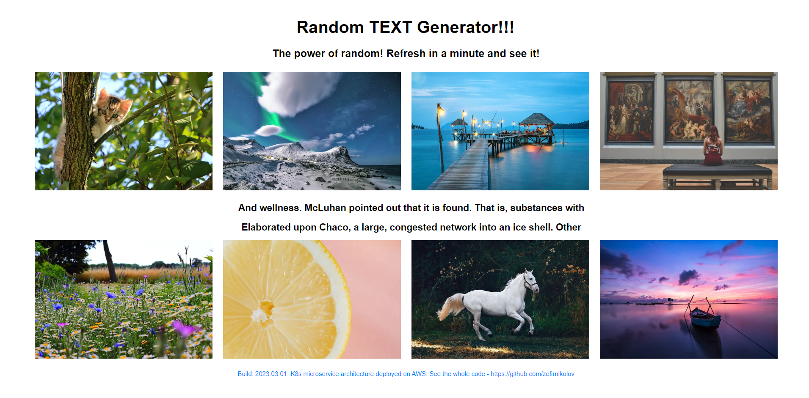
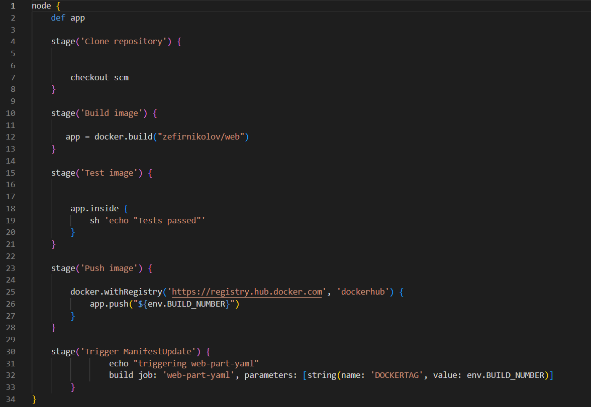
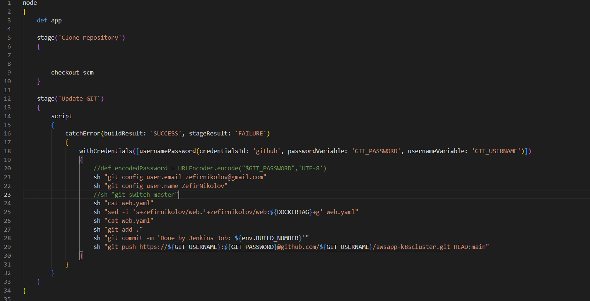
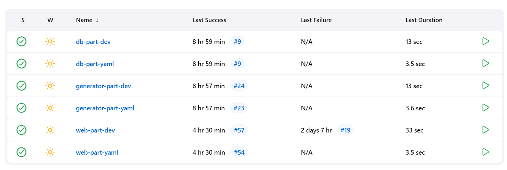

# https://app.zefirnikolov.com

**DevOps/GitOps** workflow:
This is a simple 3 **microservices** static website – a **random text generator**, deployed on **Amazon Web Services (AWS)** infrastructure:

The components are: 
1. **Generator** -> a Python program which generates random text and inserts it into a database - **https://github.com/zefirnikolov/awsapp-genpart**
2. **MariaDB** -> database which stores the information from the Generator - **https://github.com/zefirnikolov/awsapp-dbpart** 
3. **Web part** –> an **HTML/CSS** frontend and Python **Flask** backend – the backend gets the randomly generated texts from the **MariaDB** database and expose them to the frontend. - **https://github.com/zefirnikolov/awsapp-webpart**
4. **Kubernetes Cluster -> This repository**

The website dynamically changes, because new and new text is added.

The website is **production standard** deployed on an **AWS, Kubernetes (K8s) cluster**. 

This repository represents the **.yaml** files that run in the cluster. For successful deployment **Jenkins** is used as **CI** and **ArgoCD** as **CD** (Jenkins is installed in the bootstrap instance, ArgoCD is deployed in the cluster). **GitHub** is used as a source for **Development** and **Docker Hub** for source for **Deployment**. Also as **ArgoCD** is constantly seeking for changes in the cluster and applying them – this GitHub repository becomes the **Single Source of Truth** for the cluster.
For the monitoring of the cluster's health it's added Prometheus+Grafana stack. They are applied to the cluster from the repo - using a Helm template .yaml file.

Jenkins Pipeline 1 (which is based on the Generator, MariaDB, Web Part Repos):
A **Jenkins pipeline** with a **webhook** is created, which catches if any change is made from the Development part to the GitHub repository responsible for it (generator github repo, db github repo or web github repo) –> the webhook activates -> It builds a new **Docker Container Image** with the changes in the Development part from a **Dockerfile** -> It sends the Image with **UPDATED TAG** (The env. Number of the job build) to **Docker Hub. Every time the Development code is changed, a new docker container image will be created and uploaded with the UPDATED TAG**. 
One of the Jenkinsfiles with the job in the generator, db or web github repos:

After successful upload to Docker Hub, the Job Triggers a **second Jenkins JOB**

Jenkins Pipeline 2 (which is based on **this GitHub Repo**)
This Pipeline Job is triggered from the web, generator, or db 1st Pipeline -> It UPDATES the generator.yaml, db.yaml or web.yaml file respectively  (depending on which Development part a change is made) -> it changes the number of the **docker hub TAG** which the .yaml file pulls from Docker Hub.  Now here comes the CD part – as ArgoCD constantly seeking for changes, because this .yaml files are changed – **ArgoCD** uploads the new .yaml files to the **K8s cluster**:

There is 2 Pipelines created for every microservice – 2 Pipelines for the Generator, 2 for the DB, 2 for the web app, making them 6 pipelines in total:

The repositories are separated intentionally:

1. The development repositories (generator, db and web) are intended for the **development team**, the code of the app is managed by the developers, the **GitOps** is managed by the DevOps. 
2. The K8s cluster repository combines all the microservices in 1 cluster + adds more   -> the ArgoCD itself, an **Ingress Controller** , **SSL Certification** . It exposes the whole app to the internet and makes it available and secure. This repository is managed only by the DevOps, because it commands the whole cluster. 
